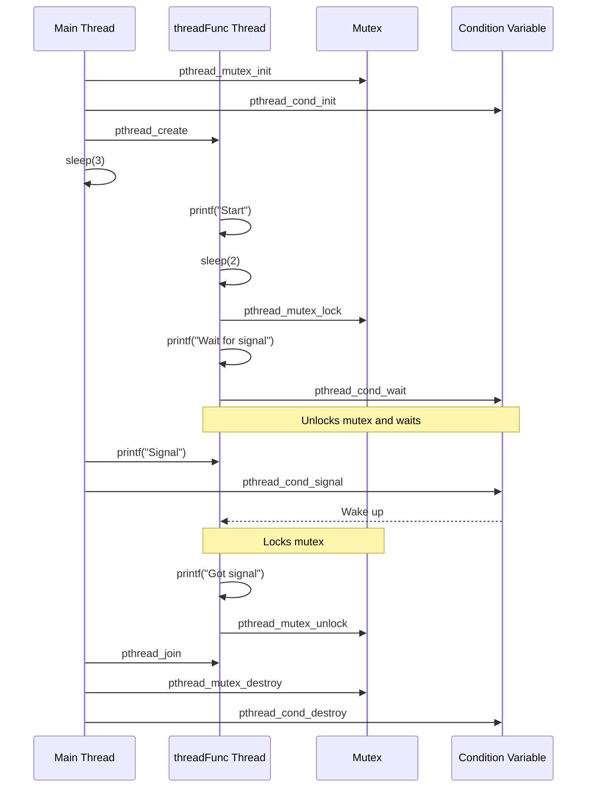

```mermaid
sequenceDiagram
    participant Main as Main Thread
    participant Thread as threadFunc Thread
    participant Mutex as Mutex
    participant Cond as Condition Variable

    Main->>Mutex: pthread_mutex_init
    Main->>Cond: pthread_cond_init
    Main->>Thread: pthread_create
    Main->>Main: sleep(3)
    Thread->>Thread: printf("Start")
    Thread->>Thread: sleep(2)
    Thread->>Mutex: pthread_mutex_lock
    Thread->>Thread: printf("Wait for signal")
    Thread->>Cond: pthread_cond_wait
    Note over Thread,Cond: Unlocks mutex and waits
    Main->>Thread: printf("Signal")
    Main->>Cond: pthread_cond_signal
    Cond-->>Thread: Wake up
    Note over Thread,Mutex: Locks mutex
    Thread->>Thread: printf("Got signal")
    Thread->>Mutex: pthread_mutex_unlock
    Main->>Thread: pthread_join
    Main->>Mutex: pthread_mutex_destroy
    Main->>Cond: pthread_cond_destroy
```

