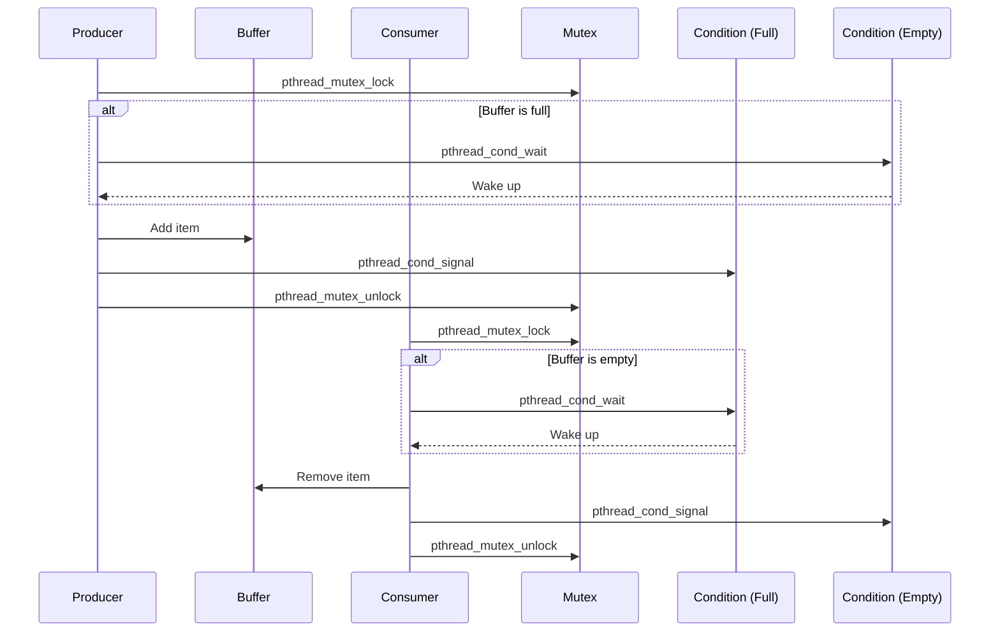

```mermaid
sequenceDiagram
    participant P as Producer
    participant B as Buffer
    participant C as Consumer
    participant M as Mutex
    participant CF as Condition (Full)
    participant CE as Condition (Empty)

    P->>M: pthread_mutex_lock
    alt Buffer is full
        P->>CE: pthread_cond_wait
        CE-->>P: Wake up
    end
    P->>B: Add item
    P->>CF: pthread_cond_signal
    P->>M: pthread_mutex_unlock

    C->>M: pthread_mutex_lock
    alt Buffer is empty
        C->>CF: pthread_cond_wait
        CF-->>C: Wake up
    end
    C->>B: Remove item
    C->>CE: pthread_cond_signal
    C->>M: pthread_mutex_unlock
```

